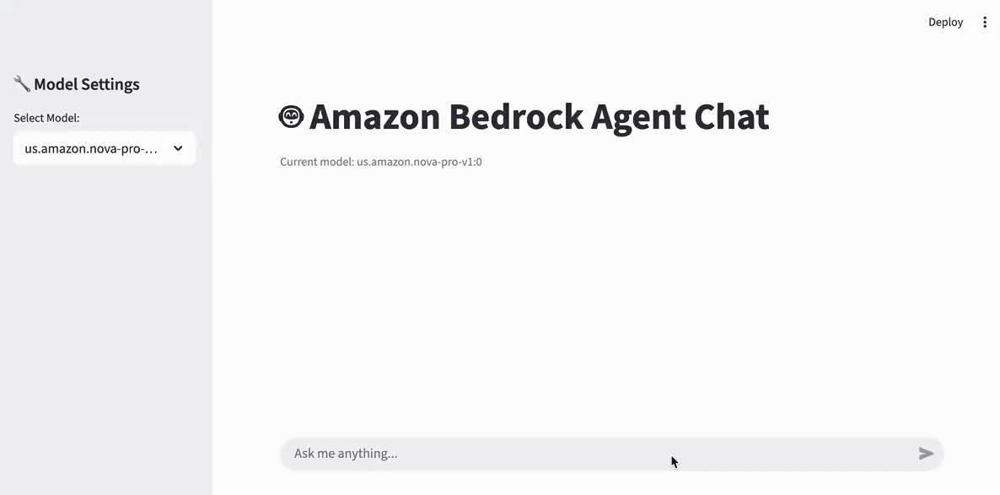

# Overview

**Streamlit Frontend Sample Project for Strands Agent**

This application provides a **scalable and robust architecture** for processing Strands Agent streaming responses in Streamlit UI. It perfectly utilizes all Strands Agent features including real-time text streaming, tool usage visualization, and reasoning process display in Streamlit.

## 🎬 Demo



> Live demo showing the application in action. You can see Chain of Thought processing, tool usage visualization, and clean streaming output.

## 🎯 Key Features

### ✨ Complete Strands Agent Integration
- **Real-time Streaming**: Live text response display (buffered streaming for clean output)
- **Tool Usage Visualization**: Calculator, weather and other tool execution processes shown as status widgets
- **Chain of Thought Processing**: Automatic `<thinking>` block detection and display in separate status widgets

### 🏗️ Scalable Architecture
- **Layered Structure**: Clear separation of UI, event processing, and business logic layers
- **Modular Design**: Single responsibility principle for each component
- **Centralized Configuration**: Unified configuration management through `AppConfig`
- **Reusable Components**: Independently testable and reusable modules
- **Thread Safety**: Safe UI updates within Streamlit context
- **Test Automation**: Comprehensive unit and integration testing

## 🚀 Quick Start

### Installation and Setup

```bash
# Clone repository
git clone <repository-url>
cd strands-agent-with-streamlit-sample

# Install dependencies
uv sync

# Run application
uv run streamlit run app.py
```

### Environment Variables Setup

#### 1. Create Environment File
```bash
# Copy sample environment file to create .env file
cp env/local.env .env
```

#### 2. Edit .env File
```bash
# Open .env file and update with actual values
vi .env
```

`.env` file example:
```env
# AWS Credentials (required for Bedrock access)
AWS_ACCESS_KEY_ID=your_actual_access_key
AWS_SECRET_ACCESS_KEY=your_actual_secret_key
AWS_DEFAULT_REGION=us-west-2

# Application Settings
DEBUG_LOGGING=false
LOG_LEVEL=INFO

# Default model selection (optional)
DEFAULT_MODEL=us.amazon.nova-pro-v1:0
```

#### 3. Alternative: System Environment Variables
```bash
# AWS CLI configuration
aws configure

# Or set environment variables directly
export AWS_ACCESS_KEY_ID=your_access_key
export AWS_SECRET_ACCESS_KEY=your_secret_key
export AWS_DEFAULT_REGION=us-west-2

# Enable debug logging (optional)
export DEBUG_LOGGING=true
```

> **Note**: System environment variables take precedence over `.env` file settings. If system environment variables are set, they will be used instead.

## 📋 Usage

1. Open **web browser** and go to `http://localhost:8501`
2. Select desired **AI model** from sidebar
3. Enter your **question** in chat input
4. View **real-time response**:
   - Clean text streaming (automatic thinking tag filtering)
   - Tool usage processes (displayed as status widgets)
   - Chain of Thought (separate expandable widgets)

### Example Queries

```
Calculation: "Please use the calculator tool to compute 1+1"
Weather: "What's the weather in Seoul?"
Complex calculation: "Please calculate 1+100"
```

### UI Features

- **Buffered Streaming**: Buffers first 20 characters to detect thinking tags for clean output
- **Status Widgets**: Tool execution and Chain of Thought displayed in separate widgets (expandable after completion)
- **Duplicate Prevention**: No duplicate output after streaming completion
- **Model Switching**: Real-time AI model switching from sidebar

## 🏛️ Architecture

### Core Components

```
┌─────────────────┐    ┌──────────────────┐    ┌─────────────────┐
│   Streamlit     │    │   BedrockAgent   │    │  Strands Agent  │
│   Frontend      │◄──►│   (Coordinator)  │◄──►│   (Backend)     │
└─────────────────┘    └──────────────────┘    └─────────────────┘
         │                        │
         ▼                        ▼
┌─────────────────┐    ┌──────────────────┐
│  Event Handler  │    │  Event Registry  │
│    System       │◄──►│   (Router)       │
└─────────────────┘    └──────────────────┘
```

### Event Handler System

| Handler | Role | Priority |
|---------|------|----------|
| `StreamlitUIHandler` | UI updates and user interface | 10 (High) |
| `ReasoningHandler` | Reasoning process handling and analysis | 30 |
| `LifecycleHandler` | Lifecycle event management | 50 |
| `LoggingHandler` | Structured logging | 80 |
| `DebugHandler` | Debug information collection | 95 (Low) |

#### UI Manager System

| Manager | Role |
|---------|------|
| `MessageUIManager` | Message streaming and final rendering |
| `COTUIManager` | Chain of Thought detection and filtering |
| `ToolUIManager` | Tool execution status and result display |
| `ReasoningUIManager` | Reasoning process status widget management |

#### New UI Layer (Refactored Structure)

| Component | Role | Lines |
|-----------|------|-------|
| `StreamlitChatApp` | Main application class | 29 lines |
| `AppConfig` | Centralized configuration management | 46 lines |
| `SessionManager` | Streamlit session state management | 71 lines |
| `UIManager` | UI component rendering | 44 lines |
| `ChatHandler` | Chat logic and streaming processing | 74 lines |
| `MessageRenderer` | Message rendering logic | 41 lines |
| `PlaceholderManager` | Placeholder creation/management | 31 lines |
| `ErrorHandler` | Integrated error handling | 33 lines |

## 📁 Project Structure

```
strands-agent-with-streamlit-sample/
├── app.py                             # Simplified entry point (13 lines)
├── pyproject.toml                     # Project configuration
├── requirements.txt                   # Python dependencies (optional)
├── uv.lock                           # UV lock file
├──
├── app/                              # 🆕 Streamlit UI Layer
│   ├── __init__.py
│   ├── main.py                       # StreamlitChatApp class
│   ├── config.py                     # Centralized configuration management
│   ├── env_loader.py                 # Environment variable loading (.env support)
│   ├── session_manager.py            # Streamlit session state management
│   ├── ui_manager.py                 # UI component rendering
│   ├── chat_handler.py               # Chat logic and streaming processing
│   └── utils/                        # UI utility modules
│       ├── __init__.py
│       ├── message_renderer.py       # Message rendering logic
│       ├── placeholder_manager.py    # Streamlit placeholder management
│       └── error_handler.py          # Integrated error handling
│
├── agents/                           # Business logic layer (maintained)
│   └── strands_agent.py              # Strands Agent integration and coordination
│
├── handlers/                         # Event processing layer (maintained)
│   ├── __init__.py
│   ├── event_handlers.py             # Event handler architecture
│   ├── lifecycle_handlers.py         # Lifecycle/logging handlers
│   ├── ui_handlers.py                # Streamlit UI dedicated handlers
│   └── ui/                          # UI manager modules
│       ├── __init__.py
│       ├── cot.py                   # Chain of Thought processing
│       ├── messages.py              # Message streaming
│       ├── reasoning.py             # Reasoning process display
│       ├── state.py                 # UI state management
│       ├── tools.py                 # Tool execution display
│       ├── utils.py                 # Utility functions
│       └── placeholders.py          # Placeholder utilities
│
├── env/                              # 🆕 Environment variable settings
│   └── local.env                     # Sample environment variable file
│
├── tests/
│   ├── test_streamlit_flow.py        # UI flow testing
│   └── test_thread_safety.py         # Thread safety testing
└── .venv/                            # Virtual environment
```

## Running Tests

```bash
# UI flow tests
python tests/test_streamlit_flow.py

# Thread safety tests
python tests/test_thread_safety.py

# All tests (when pytest is installed)
pytest tests -v
```

## 🤝 Contributing

1. **Fork** the repository
2. **Create feature branch** (`git checkout -b feature/amazing-feature`)
3. **Commit changes** (`git commit -m 'Add amazing feature'`)
4. **Push branch** (`git push origin feature/amazing-feature`)
5. **Create Pull Request**

### Development Guidelines

#### Code Quality
- **Single Responsibility Principle**: Each class and function should have one clear responsibility
- **Module Size**: Recommended 80 lines or less per file (excluding complex logic)
- **Type Hints**: Add type hints to all functions and methods
- **Code Style**: Follow PEP 8

#### Architecture
- **Layer Separation**: UI layer (`app/`) should only use event processing layer (`handlers/`)
- **Configuration Centralization**: Add new settings to `AppConfig`
- **Error Handling**: Use integrated error handling through `ErrorHandler`

#### Testing
- Submit new components with tests
- All existing tests must pass
- Write independent unit tests for each module

## 📄 License

This project is distributed under the MIT License.

---

**Experience the perfect integration of Strands Agent + Streamlit!** 🚀
